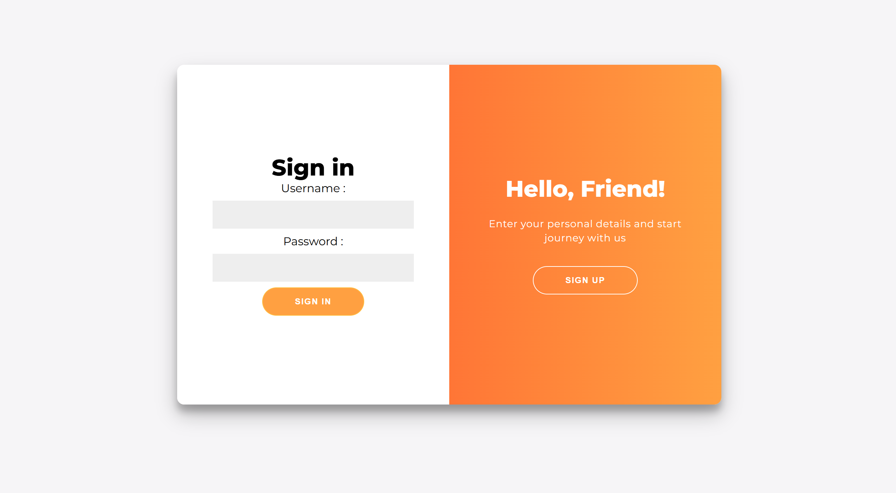
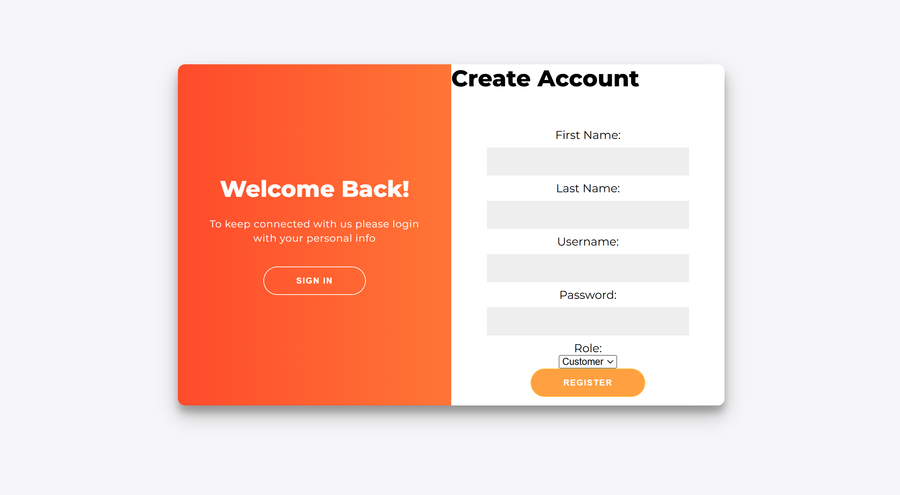
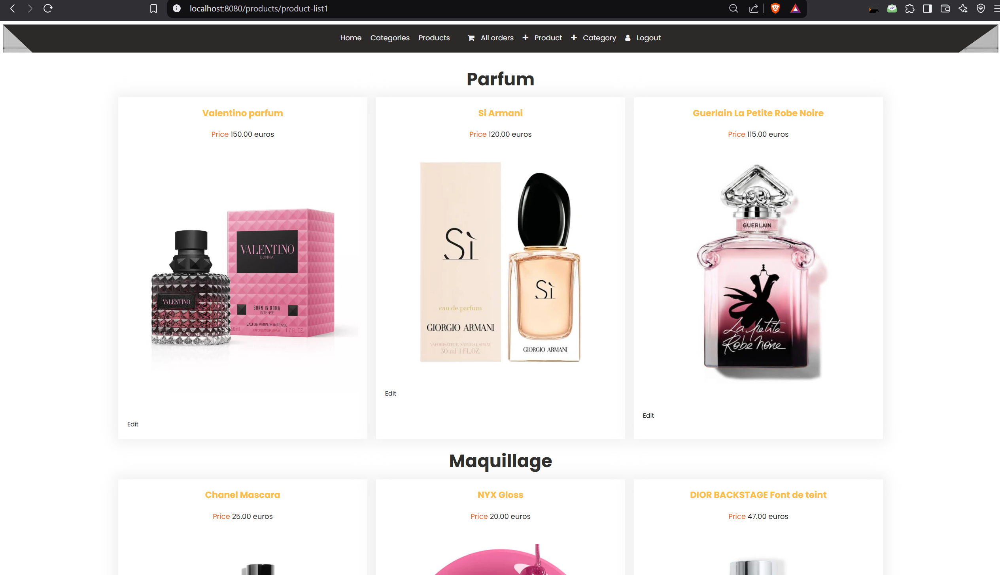
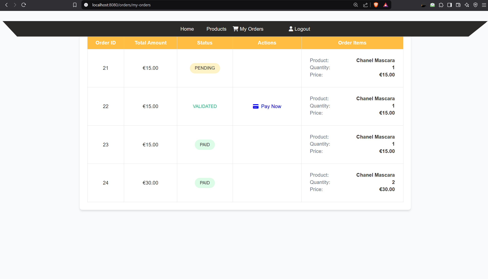
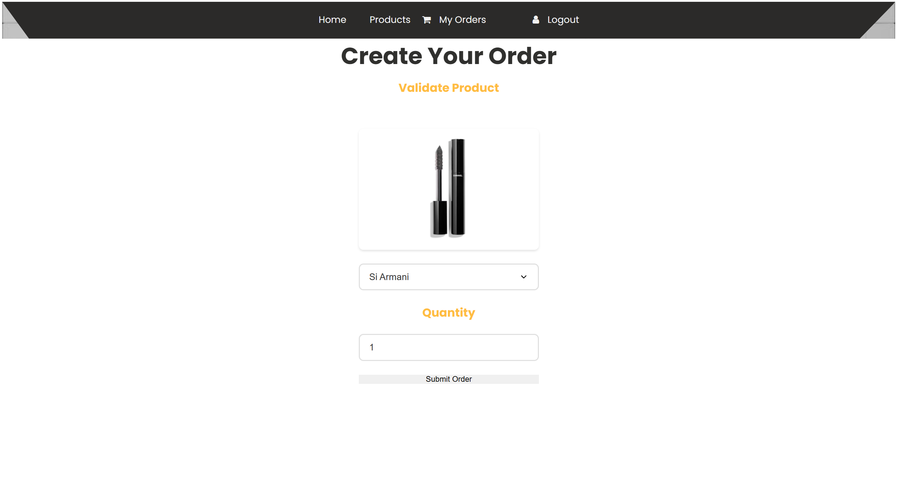
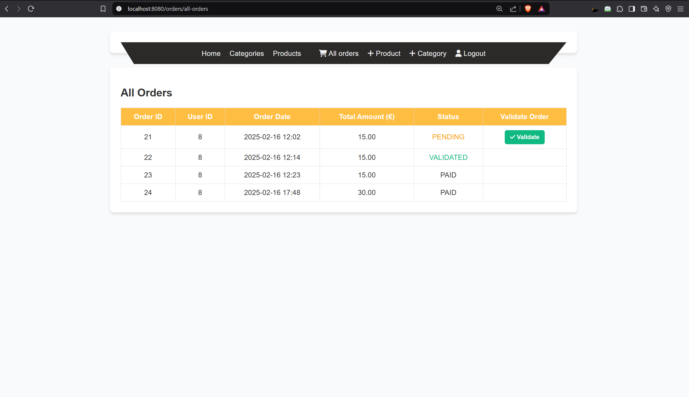
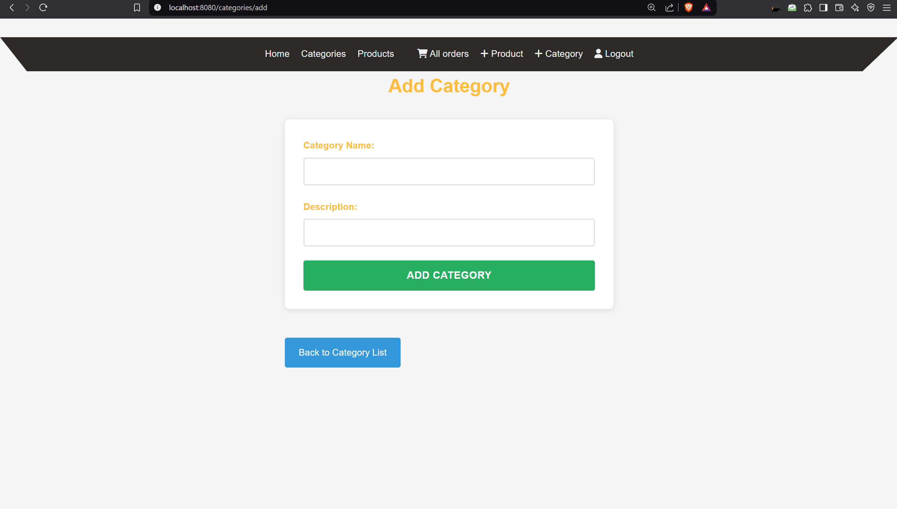

# Application E-Commerce Spring Boot

Cette application e-commerce est basée sur Spring Boot et offre des fonctionnalités telles que la navigation des produits, l'authentification des utilisateurs, la gestion du panier et le traitement des commandes.

## Table des Matières
- [Fonctionnalités](#fonctionnalités)
- [Technologies Utilisées](#technologies-utilisées)
- [Installation](#installation)
- [Importation de la Base de Données dans MySQL Workbench](#importation-de-la-base-de-données-dans-mysql-workbench)
- [Exécution de l'Application](#exécution-de-lapplication)
- [Endpoints API](#endpoints-api)
- [Captures d'Écran](#captures-décran)


## Fonctionnalités
- Authentification et autorisation des utilisateurs avec JWT
- Catalogue de produits avec catégories
- Fonctionnalité de panier d'achat
- Roles CUSTOMER et OWNER 
- Système de gestion et validation des commandes 
- Intégration des paiements
- Tableau de bord administrateur pour la gestion des produits, commandes et utilisateurs

## Technologies Utilisées
- Java 17
- Spring Boot 3.x
- Spring Security (authentification JWT)
- Hibernate (JPA)
- Base de données MySQL
- Thymeleaf (pour les templates front-end) / HTML CSS
- Lombok (réduction du code standard)

## Installation

### Prérequis
Assurez-vous d'avoir installé les éléments suivants sur votre système :
- Java 17 ou version ultérieure
- Maven 3.x
- Serveur MySQL & MySQL Workbench
- Postman (pour tester l'API, optionnel)

### Cloner le Dépôt
```sh
git clone https://github.com/yasmineslisli/ecom.git
cd ecommerce
```

## Importation de la Base de Données dans MySQL Workbench
Suivez ces étapes pour importer la base de données :

1. Ouvrez **MySQL Workbench** et connectez-vous à votre serveur MySQL.
2. Creation du schema 'ecommerce-db'
2. Cliquez sur **Administration** -> **Data Import/Restore** -> **Import from Disk** 
3. -> **Import from Dump Project Folder** -> mettre le path du répertoire du projet ......\ecommerce\src\main\resources\database
5. Cliquez sur **Start Import** et attendez la fin du processus.
6. Vérifiez les tables importées sont :
   ```
   token
   users
   product
   orders
   order_items
   payment_details
   ```

## Exécution de l'Application

1. Configurez `application.properties` ou `application.yml` avec vos identifiants de base de données :
   ```properties
   spring.datasource.url=jdbc:mysql://localhost:3306/ecommerce
   spring.datasource.username=root
   spring.datasource.password=votremotdepasse
   spring.jpa.hibernate.ddl-auto=update
   spring.jpa.show-sql=true
   ```

2. Construisez et exécutez le projet avec Maven :
   ```sh
   mvn clean install
   mvn spring-boot:run
   ```

3. L'application sera disponible à l'adresse `http://localhost:8080/login`.

## Endpoints API
Il suffit de lancer `http://localhost:8080/login` et suivre les liens de l'application


Role CUSTOMER:
   Username: riri
   Password: riri

| Endpoint CUSTOMER             | Méthode | Description                   |
|-------------------------------|---------|-------------------------------|
| `/login`                      | POST    | Login et register             |
| `/api/products/product-lists1`| GET     | Récupérer tous les produits   |
| `/orders/my-orders`           | GET     | Récupérer mes commandes       |


Role OWNER(ADMIN):
Username: slisli
Password: slisli


| Endpoint OWNER                 | Méthode | Description                              |
|--------------------------------|---------|------------------------------------------|
| `/login`                       | POST    | Login et register                        |
| `/api/products/product-lists1` | GET     | Récupérer tous les produits              |
| `/orders/all-orders`           | GET     | Récupérer toutes les commandes des users |
| `/products/add`                | POST    | Créer un produit                         |
| `/categories/add`              | POST    | Créer une catégorie                      |
| `categories/category-list`     | POST    | Récupérer toutes les catégories          |

...

## Captures d'Écran
### Page de login


### Page de register


### Welcome page


### Page des produits par catégorie


### Mes commandes en tant que client


### Creation de commande


### Toutes les commandes des clients


### Les commandes des clients vue par le owner


### Creation de produit par owner


### Creation de categorie



---

Pour toute question, n'hésitez pas à m'envoyer un mail sur `yasmine.slisli2001@gmail.com` ou bien `yasmine.essalmani@etu.eilco.univ-littoral.fr`.

